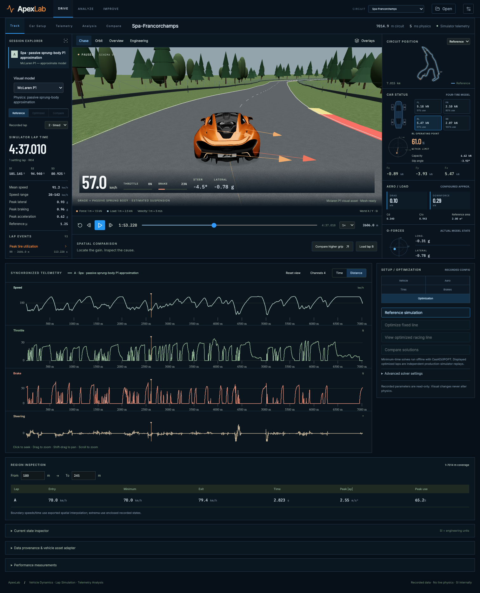
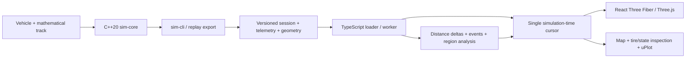

# ApexLab

**Vehicle Dynamics · Lap Simulation · Telemetry Analysis**

ApexLab connects validated C++ vehicle dynamics to an interactive engineering workspace. Replay
recorded laps in 3D, inspect individual tire forces, cross-seek telemetry and track position, and
compare setups by distance. Every engineering value comes from simulation output or a documented
derivation. The baseline vehicle and circuit are synthetic engineering fixtures, not OEM data.
Milestone 6 Phase A also provides a clearly labeled `McLaren P1 — approximate model` configuration;
its published, derived, estimated, fitted, and unknown inputs are documented in
[`docs/vehicles/mclaren-p1-approx.md`](docs/vehicles/mclaren-p1-approx.md).

Milestone 5.5 adds actual P1/F1 visual rigs, physical grade forces and an optional passive
sprung-body model. See the [implementation report](docs/experiments/milestone-5_5-results.md),
[model equations](docs/physics/road-sprung-body-model.md), and [asset commands/credits](assets/cars/README.md).
Existing optimization artifacts are preserved; no new optimization was performed in this bridge milestone.



## Launch the application

Requirements: Node.js 22.12+ (tested with 24.10), npm and a desktop WebGL2 browser.
The generated demonstration sessions are included locally; running C++ first is optional.
Processed car binaries are intentionally ignored by Git. On a fresh checkout, run the
[asset processing commands](assets/cars/README.md) with the supplied source packages before opening
P1/F1 visuals. Missing assets show an explicit error and a procedural fallback.

```sh
cd apps/dashboard
npm ci
npm run dev
```

Open **http://127.0.0.1:5173**. The demonstration opens the elevated Spa/P1 passive sprung-body reference session. Play, select an
event, click the map/telemetry, or frame-step. Select **Technical Test Circuit** to load the reference
and validated locally optimized racing-line replay, then switch among Reference, Optimized, and
Compare. **Open session** / **Load lap B**
accept `session.json` and its declared companion files selected together (including `chassis.csv`
for sprung-body sessions). Files remain local.

Chase, orbit, overview and engineering cameras share the same recorded vehicle pose. The overlay
menu exposes tire forces, loads, axes/CG, velocity, reference line, boundaries and trajectory.
Charts support time/distance, channel selection, drag zoom, shift-drag pan and click-to-seek.
The region inspector compares entry/minimum/exit speed, interval time and peak tire demand.

## Build the simulator and generate a session

Requirements: C++20 compiler, CMake 3.24+ and Python 3.10+.

```sh
cmake -S . -B build -DCMAKE_BUILD_TYPE=Release
cmake --build build --parallel
ctest --test-dir build --output-on-failure

python3 tools/python/replay/export_session.py \
  --output data/generated/my-session --name 'Technical circuit · baseline'
```

The exporter runs the existing nonlinear lap model, writes schema-v4 telemetry, and adds recorded
wheel forces, sampled track geometry, C++ spatial samples and simulator lap/sector results.
Use `--vehicle`, `--track`, `--warmup-laps` and `--laps` to select configurations and lap counts.
See the [replay contract](docs/architecture/milestone-5-replay.md) for formats and interpolation.

The Milestone 6 Phase A [OSM importer](docs/tracks/osm-import.md) adds Spa-Francorchamps, Monza,
Silverstone, and Suzuka as versioned mathematical tracks. Spa includes terrain-derived Copernicus
elevation; its metadata explicitly distinguishes DSM elevation from survey-grade circuit data.

The simulator remains independently usable:

```sh
./build/apps/sim-cli/apexlab-sim \
  --vehicle configs/vehicles/generic_nonlinear_performance_car.json \
  --track configs/tracks/technical_test_circuit.json \
  --output data/generated/technical_lap.csv \
  --warmup-laps 1 --laps 1 --dt 0.005 --controller-dt 0.02
```

## Architecture



`cpp/sim-core` has no frontend dependencies. `apps/dashboard` contains the React/TypeScript/Vite
client; `packages/telemetry-schema` contains the shared field contract. Physics equations,
experiments and rendering/interpolation policy remain under `docs/`.

## Measured reference lap

The Milestone 4 technical circuit is **1,078.754 m**. At a 5 ms physics / 20 ms controller period,
after one settling lap:

| Quantity | Simulator result |
|---|---:|
| Lap time | 50.710 s |
| Sector times | 13.365 / 18.895 / 18.450 s |
| Mean speed | 21.381 m/s (77.0 km/h) |
| Speed range | 12.865–38.201 m/s |
| Peak lateral acceleration | 9.188 m/s² |
| Peak braking magnitude | 7.390 m/s² |
| Maximum lateral error | 1.488 m |
| Peak utilization | 100%, RL at 775.031 m |

The included higher-grip session changes only reference tire μ from 1.20 to 1.35 with the same
settling procedure: **48.845 s**, a **1.865 s** gain. Its distance-based delta reveals where the gain
accumulates. M4's original *unsettled* sensitivity runs were 50.935/49.070 s; those are a different
protocol. These are feasible controller-driven laps, not optimal lines or minimum-time solutions.

## Physics and validation

The preserved longitudinal model includes drive/brake, drag, rolling resistance and traction
limits. The linear dynamic bicycle model provides a validated reference. The nonlinear four-tire
model adds Fiala/brush-inspired saturation, combined-force capacity, load-sensitive friction and
quasi-static load transfer. A periodic mathematical track supplies projection, a reference line,
conservative speed planning, controllers and lap/sector timing.

| Milestone | Equations / design | Experiments |
|---|---|---|
| 1 · Longitudinal | [Model](docs/physics/longitudinal-model.md) | [Results](docs/experiments/initial-milestone-results.md) |
| 2 · Linear planar | [Model](docs/physics/planar-bicycle-model.md) | [Results](docs/experiments/milestone-2-results.md) |
| 3 · Nonlinear four-tire | [Model](docs/physics/nonlinear-four-tire-model.md) | [Results](docs/experiments/milestone-3-results.md) |
| 4 · Track and laps | [Model](docs/physics/track-and-lap-model.md) | [Results](docs/experiments/milestone-4-results.md) |
| 5.5 · Road and sprung-body integration | [Model](docs/physics/road-sprung-body-model.md) | [Results and screenshots](docs/experiments/milestone-5_5-results.md) |
| 5 · Engineering application | [Plan](docs/architecture/milestone-5-plan.md), [Replay contract](docs/architecture/milestone-5-replay.md) | [Tests, screenshots and performance](docs/experiments/milestone-5-results.md) |
| 6A · Real assets and tracks | [OSM import](docs/tracks/osm-import.md), [P1 approximation](docs/vehicles/mclaren-p1-approx.md) | [Phase A results](docs/experiments/milestone-6-phase-a-results.md) |
| 6B–C · Real rendering and UI | [Track pipeline](docs/tracks/osm-import.md) | [Phase B](docs/experiments/milestone-6-phase-b-results.md), [Phase C](docs/experiments/milestone-6-phase-c-results.md) |
| 6D–F · Minimum time and comparison | [Phase D formulation/results](docs/experiments/milestone-6-phase-d-results.md) | [Free line + product](docs/experiments/milestone-6-phase-e-f-results.md), [full report](docs/experiments/milestone-6-final-report.md) |

Regenerate the numerical validations (these commands regenerate their reports/artifacts):

```sh
python3 tools/python/validation/run_validation.py --sim build/apps/sim-cli/apexlab-sim --output-dir data/generated/validation
python3 tools/python/validation/run_planar_validation.py --sim build/apps/sim-cli/apexlab-sim --output-dir data/generated/planar-validation
python3 tools/python/validation/run_milestone3_validation.py --sim build/apps/sim-cli/apexlab-sim --output-dir data/generated/milestone-3
python3 tools/python/validation/run_milestone4_validation.py --sim build/apps/sim-cli/apexlab-sim --output-dir data/generated/milestone-4
python3 tools/python/replay/validate_export.py
```

Run application checks:

```sh
cd apps/dashboard
npm test
npm run build
npx playwright install --no-shell chromium
npm run test:e2e
```

The browser suite starts/reuses the development server, exercises the main interactions, captures
screenshots and writes measured frame/seek/load timings. For production testing, run `npm run
preview` in a second terminal and use `PLAYWRIGHT_BASE_URL=http://127.0.0.1:4173 npm run test:e2e`.
The application's expandable performance panel can also measure the current view interactively.

## Milestone 5.5 reproduction

```sh
cmake --build build --parallel
ctest --test-dir build --output-on-failure
.cache/car-venv/bin/python tools/python/validation/run_milestone5_5_validation.py
python3 tools/python/replay/export_chassis_scenes.py
python3 tools/python/replay/export_session.py --vehicle configs/vehicles/mclaren-p1-sprung-approx.json --track configs/tracks/spa-francorchamps.json --output data/generated/spa-p1-sprung --name 'Spa · passive sprung-body P1 approximation' --maximum-duration 700
```

Copy the generated Spa session directory to `apps/dashboard/public/demo/spa-p1-sprung` to publish
that local demo. The ordinary `mclaren-p1-approx.json` retains the validated planar mode; the
`mclaren-p1-sprung-approx.json` variant enables grade and body dynamics. There are no invented active
suspension parameters. **Visual model** switches P1/F1 independently of the physical session.

Open `/?scene=flat`, `uphill`, `downhill`, `left`, `right`, `braking`, or `acceleration` for six-second
C++ physical validation intervals. These are explicitly labeled **not a lap**. Enable
**Overlays → Road/body axes + wheel contacts + CG** to inspect grounding and recorded chassis values.

## Explicit limits

- Vehicle dynamics remain planar/still-air and do not yet apply the v2 track's grade to forces;
  banking remains zero. There is no suspension travel, transient tire behavior, wheel rotational
  dynamics, differential, ABS/TC, thermal model or detailed powertrain.
- The runtime car remains an illustrative procedural fallback. The authenticated-download P1
  preprocessing pipeline is ready, but no source or processed P1 mesh is fabricated or committed;
  visual meshes never set physical parameters.
- Recorded sessions only; optimization runs offline with CasADi/IPOPT and is then exported as a
  production-simulator replay. No live transport, accounts, or cloud services.
- Distance comparison uses shared exported coverage (1–1078 m in the demos), with no fabricated
  start/finish extrapolation. Recorded lap times remain separate from interpolated region times.
- Desktop first. WebGL2 required. Large multi-hour object-array sessions, mobile, external-resource
  GLTF packages and production asset art have not been validated.
