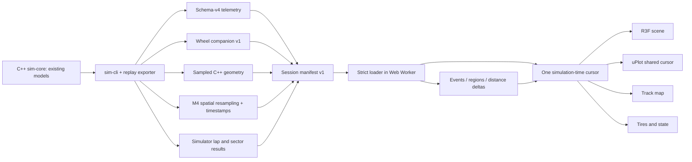

# Milestone 5 replay and analysis contract

## Authority and architecture

`apps/dashboard` is a standalone React 19 / TypeScript / Vite application. React Three Fiber
owns the Three.js scene; uPlot owns canvas telemetry plots. Neither library is linked to the
C++ core. No physics model or integrator was changed for this milestone.

The source layout separates `telemetry`, `analysis`, `state`, `three`, `components`, `workers`
and `data`. The field contract is centralized in
[`packages/telemetry-schema/schema-v4.ts`](../../packages/telemetry-schema/schema-v4.ts);
the dashboard re-exports it. Real-export tests catch field drift against C++ output. This is
central maintenance with contract tests, not an automatically generated C++ binding.

## Files and versions

Generate a session with `tools/python/replay/export_session.py`. It invokes the normal CLI
with `--track-geometry` and the new additive `--replay-data DIR` option. The CLI exporter lives
in `apps/sim-cli/replay_export.cpp`; simulation equations and schema-v4 output remain intact.

Each directory contains `session.json`, `telemetry.csv`, `wheels.csv`, `geometry.csv`,
`spatial.csv`, and provenance copies `vehicle.json`, `track.json`, `results.json`.
The application needs the manifest and its four named CSV companions. In **Open session**,
select those five files together. **Load lap B** accepts the same format. Nothing is uploaded.

The manifest declares session version 1, telemetry 4, wheel companion 1 and spatial 1;
vehicle dimensions/assumptions; track length, reference offset, geometry fingerprint and
sector fractions; physics/controller periods; and explicit completed-lap start/end timestamps,
recorded durations and sector durations. Filenames must be local siblings. Multiple completed
laps are selectable; the manifest distinguishes settling laps from timed laps.

The wheel companion has an exact `time_s` + `step` join and serializes six already-computed
quantities for FL/FR/RL/RR: Fz, delivered wheel-frame Fx/Fy, slip angle, force capacity and
saturation flag. Utilization remains authoritative schema-v4 data. No force recomputation occurs.

Parsing and validation run in a dedicated worker. Unsupported versions, missing columns/files,
blank/nonfinite values, nonmonotonic time/progress, invalid flags, mismatched joins, invalid lap
coverage and inconsistent lap/sector timing fail with visible errors. There are no numeric
fallbacks for unavailable engineering channels. Loading failures preserve the current session.
The geometry fingerprint is provenance; compatibility checks actual decoded geometry, not merely
its name or claimed fingerprint. CSV input is the simulator's numeric unquoted format.

## Cursor and interpolation

`ReplayStore` owns simulation timestamp, playback rate and playback state. The R3F frame callback
advances it once before applying scene state. React panels use `useSyncExternalStore`; charts
subscribe imperatively to update their cursor without rebuilding data/zoom. All read the same
snapshot. Hidden tabs pause, avoiding a large wall-clock jump when returning.

- Position, velocity, forces, load, capacity, utilization and other continuous scalars: linear.
- Yaw and heading error: shortest angular difference across ±π.
- Saturation/on-track flags, step, lap and sector identifiers: left hold, switching on the exact
  recorded timestamp. Frame-step selects actual recorded rows, including irregular endpoints.
- Track position: interpolate monotonic unwrapped progress then wrap by exported track length.
- Discontinuous lap elapsed resets are not blended. The visible lap timer is cursor minus the
  selected lap's **simulator** start timestamp; recorded lap duration is separate and unchanged.

Render interpolation does not reintegrate position, compute tire forces or alter recorded values.
Friction operating points divide interpolated wheel force components by interpolated recorded
capacity. Their norm can differ slightly from separately interpolated recorded utilization
between samples; both agree at recorded states. Zero capacity has no normalized point.

Replay provides play/pause, restart, 0.1/0.25/0.5/1/2/4×, continuous seek and exact frame-step.
Space toggles playback and arrow keys step when focus is outside inputs/buttons. Map/events/chart
clicks pause and seek. The map uses the nearest exported geometric sample, and a monotonic
progress lookup restricted to the explicitly selected lap. Exact timeline endpoints remain
reachable despite floating-point timestamp accumulation.

The default demo is deterministic: paused at the generic maximum-utilization event. Peak ties
use the same lexicographic `(raw utilization, wheel suffix, track s)` maximum as M4. This recovers
RL at 775.031 m without a product constant. Other extrema use earliest timestamp on exact ties;
saturation onsets are per-wheel 0→1 transitions. Values are never rounded before detection.

## Rendering and assets

Coordinate mapping is `(X, Y, yaw) → (X, up, −Y)` and a positive Three Y rotation. World units
are meters. Road ribbon vertices come directly from 2,001 samples exported by
`PeriodicTrack::frame_at_s`, including asymmetric left/right widths. The closed seam is explicit;
there is no independent JavaScript spline. Shoulders extend widths deterministically by 28%.
Reference offset, boundaries, sector/start-finish marks and trajectory use exported data.

Cameras: smoothed chase, car-centered orbit, full-circuit overview and stable rear-quarter
engineering follow. Only camera transforms are smoothed. Vehicle pose is applied directly from
the shared snapshot. The placeholder is a repository-authored procedural coupe, independent of
mass, force limits or any other physical configuration. Wheels show recorded front steering;
wheel rotation and suspension motion are intentionally absent.

`AssetAdapter` accepts URL, scale, Euler orientation and offset. The UI loads self-contained
GLB or embedded-resource GLTF with scale/yaw adjustment. External-resource GLTF directories
require prepackaging; there is no multi-file resource resolver. Imported assets should have
+X forward, +Y up, −Z left and origin at ground below CG; code-level offset supports other pivots.
Invalid assets fall back to the placeholder. No proprietary vehicle asset is included.

Materials use PBR, ACES filmic tone mapping, antialiasing, a generated environment light and
soft filtered shadows. Lighting/mesh dimensions are illustrative. There is no bloom or blur.

Overlays: wheel-force vectors, vertical load bars, velocity vector, body axes/CG, trajectory,
reference line and boundaries. Front wheel-frame forces are rotated by recorded steering before
placing vectors in the body/world frame. This is a coordinate transform, not a force model.
Vectors are drawn above occlusion for inspection, not as physical objects. Explicit scales:
force **1 render m = 1.5 kN**; load **1 render m = 2.5 kN**; velocity **1 render m = 5 m/s**.
Tire utilization appears in four meters and the selected tire's force/capacity friction circle.

## Spatial comparison and regions

The existing C++ `resample_lap_spatially` produces the 1 m grid and its speed, controls, lateral
acceleration, maximum utilization and path error. The exporter excludes the wrapped finishing
sample before calling it: M4 labels that crossing row with the lap it finishes, so sorting it by
wrapped s would contaminate the beginning of the grid. Additional timestamps interpolate the
same bracketing recorded samples. Physics and the original resampling function remain untouched.

The dashboard uses these exported values directly; other enabled channels sample the recorded
stream at the exported timestamps. Distance-mode plots never reimplement track projection or
numerically integrate speed to invent time. Grid-to-grid alignment is piecewise linear within
shared coverage only:

`delta_t(s) = [t_B(s) − start_B] − [t_A(s) − start_A]`

`delta_v(s) = v_B(s) − v_A(s)`

Negative delta time means B is ahead. Equal track names are insufficient: full geometry, length
and reference offset must match. No spatial extrapolation across start/finish occurs. The demo
coverage is 1–1078 m; 0 and the exact finish remain available for replay, but comparison displays
“Outside spatial coverage” there. Recorded final lap difference is shown separately. The demo
changes only tire reference friction, 1.20→1.35, with the same warmup/controller/physics settings.

Region endpoints interpolate the exported distance/time grid; interval time is the difference
of those timestamps. Entry/exit speeds use exported spatial speed. Min speed, peak absolute
lateral acceleration and peak utilization include all enclosed raw samples and interpolated
endpoints. Reversed, seam-crossing or out-of-coverage bounds are rejected, not silently clamped.
Regions are distances, without invented corner names.

Charts offer all eight required body/control channels, four utilization channels and four normal
loads, plus speed/time deltas. Click seeks; drag zooms all plots; shift-drag pans; wheel zooms;
reset restores the domain. Amber is the shared replay cursor; hover readouts inspect local values.
Playback does not reset zoom. Switching lap or time/distance domain resets it intentionally.
Comparison traces are available in distance mode; time mode shows Lap A.

## Units, precision and origin

SI is retained in memory. `data/units.ts` centralizes conversion and formatting. Raw interpolated
values are available in the state inspector; displayed precision is a presentation decision.

| Display | Origin | Display units / typical precision |
|---|---|---|
| Pose, speed, vx/vy, yaw rate | schema-v4 recorded state | km/h 0.1; inspector m/s 0.001; °/s 0.01 |
| Steering, throttle, brake | schema-v4 controller command | ° 0.1 (inspector 0.01); % 1 |
| Body accelerations | schema-v4 model forces / mass | g 0.01; inspector m/s² 0.001 |
| Track position and errors | schema-v4 C++ projection/reference | m 0.1; errors m 0.001 / ° 0.01 |
| Fz/Fx/Fy, capacity, slip | joined wheel companion, existing forces | kN 0.01; ° 0.01 |
| Utilization/saturation | schema-v4 ratio / wheel companion flag | % 1 (selected 0.1) / categorical |
| Lap/sector duration | simulator result in manifest | s 0.001 |
| Mean/range/extrema | deterministic selected-lap sample reduction | km/h 0.1; g 0.01 |
| Region and delta time | exported spatial timestamps | s 0.001 |
| Mass, reference μ, dimensions | explicitly declared configuration metadata | kg / dimensionless / m |
| UI timings | browser performance clock | ms 0.001 in downloadable measurements |

Mean speed is the arithmetic mean of selected-lap samples, matching the M4 experiment convention.
No temperature, pressure, fuel, RPM, suspension travel or dynamic ride-height quantities exist.

## Scope and follow-up

The application is local recorded replay. No sockets, accounts, cloud services, optimizer,
racing-line search, new vehicle dynamics or gameplay were added. Large files are decoded in a
worker but then transferred as object arrays; million-row endurance sessions, streaming and
columnar binary formats remain future work. Rendering requires WebGL2. Mobile is not a target;
the layout rearranges at 1024 px and keeps a 700 px minimum width below that.

Next milestone: reproducible setup-study management and analysis—batch parameter experiments,
provenance-aware comparison collections, measurement uncertainty and exportable region reports.
Keep physics expansion and minimum-time optimization as separate future milestones.
