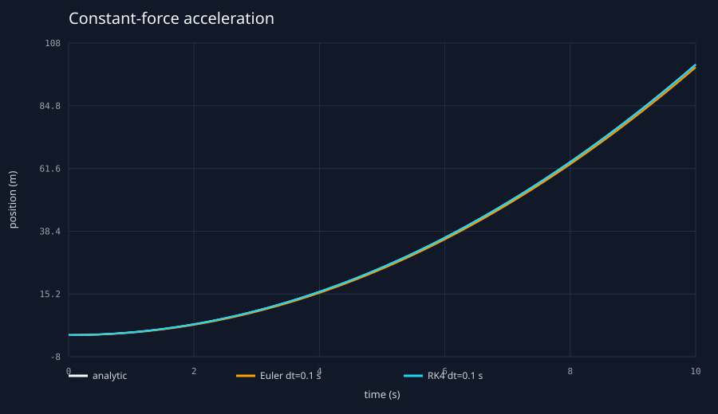
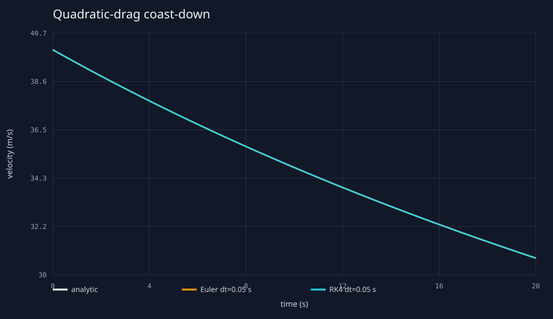
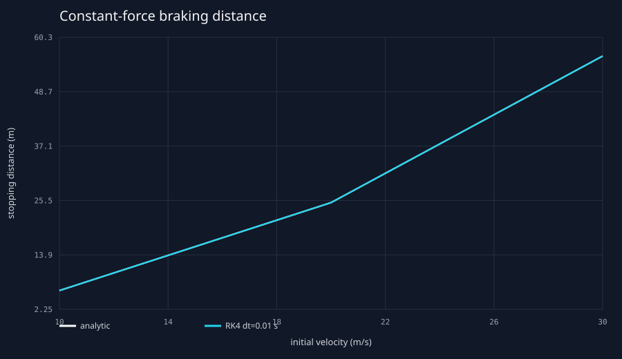
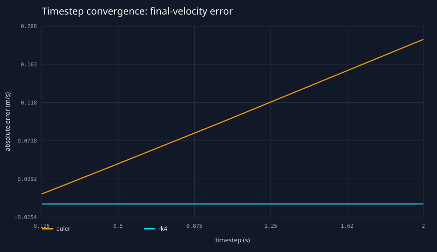

# Initial milestone validation results

This report is generated by `tools/python/validation/run_validation.py` from the compiled C++ CLI.
The vehicle files used here are analytical fixtures, not real-vehicle calibrations. Results were
regenerated locally; full-precision values are in `data/generated/validation/summary.json`.

## Constant-force acceleration

Setup: `m = 1000 kg`, `F = 2000 N`, `v0 = 0`, duration `10 s`, and `dt = 0.1 s`.
The analytical result is `v = 20 m/s` and `x = 100 m`.

| Integrator | final velocity error (m/s) | final position error (m) |
|---|---:|---:|
| Euler | 3.90798505e-14 | 1 |
| RK4 | 3.90798505e-14 | 9.9475983e-14 |

Euler integrates velocity exactly for constant acceleration but uses beginning-of-step velocity for
position, producing the expected `1 m` error. RK4 reproduces the quadratic position solution to
floating-point precision.

## Quadratic-drag coast-down

Setup: `m = 1200 kg`, `rho = 1.225 kg/m^3`, `Cd = 0.35`, `A = 2.10 m^2`,
`v0 = 40 m/s`, duration `20 s`, and `dt = 0.05 s`. Rolling resistance is disabled so the closed
form `v(t) = v0 / (1 + k v0 t)` applies.

| Integrator | final velocity error (m/s) | final position error (m) |
|---|---:|---:|
| Euler | 0.00466363005 | 0.173020355 |
| RK4 | 1.42108547e-13 | 1.34150469e-11 |

## Constant-force braking

Setup: `m = 1000 kg`, brake force `8000 N`, RK4, and `dt = 0.01 s`. The stop event is
located inside the final nominal step and clamped at zero speed.

| initial speed (m/s) | analytical distance (m) | simulated distance (m) | error (m) |
|---:|---:|---:|---:|
| 10 | 6.25 | 6.25 | 7.10542736e-15 |
| 20 | 25 | 25 | 1.84741111e-13 |
| 30 | 56.25 | 56.25 | 8.52651283e-13 |

Maximum distance error: `8.52651283e-13 m`.

## Terminal-velocity equilibrium

For `1200 N` drive force and `98.0665 N` rolling resistance, the analytical force balance gives
`v_terminal = 42.8550561 m/s`. Starting exactly at this speed changed velocity by
`0 m/s` over 10 seconds, within floating-point evaluation error.

## Timestep convergence

The coast-down simulation was repeated from `dt = 2 s` through `0.125 s`. At the finest tested
step, Euler's final-speed error was `0.0116723217 m/s` and RK4's was
`2.22399876e-12 m/s`. Pairwise observed orders are recorded in
`data/generated/validation/timestep_convergence.csv`; they approach first order for Euler and
fourth order for RK4 as expected for this smooth ODE.

## Interpretation and limitations

These experiments validate implementation behavior against equations the model was designed to
solve. They do not validate fidelity to a real vehicle. In particular, constant force fixtures
remove power curves, tire slip, load transfer, road grade, and environmental variability. The
terminal-speed case checks equilibrium consistency, not a measured top speed. Later model changes
must retain these fixtures as regression tests and add independent measured-data validation.
