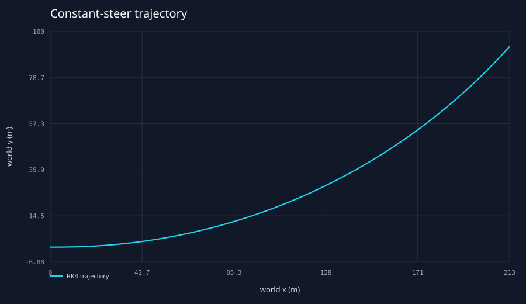
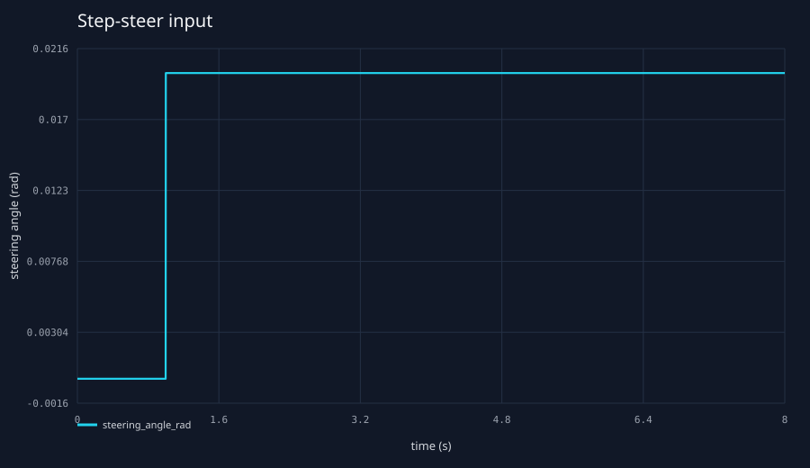
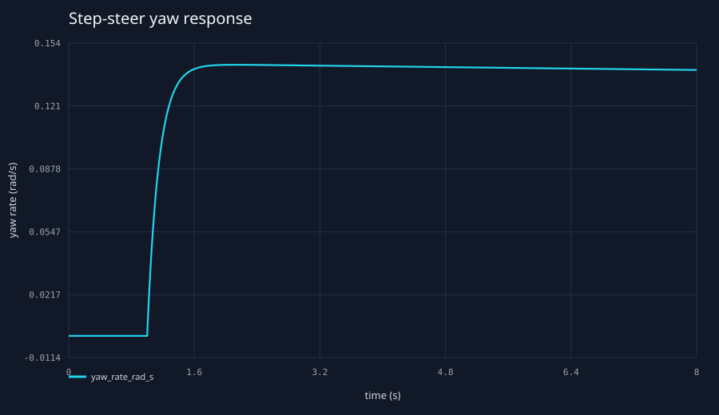
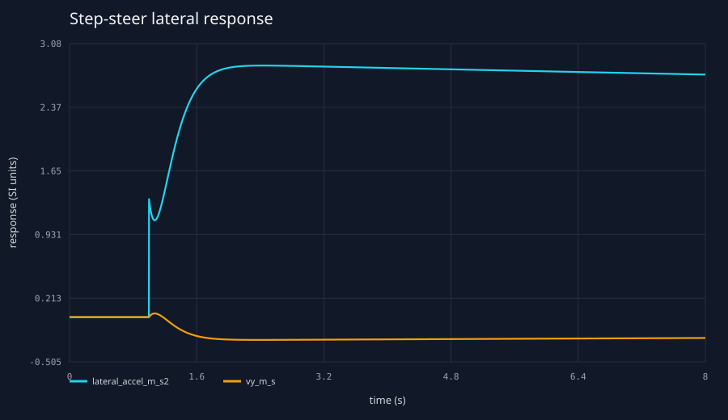
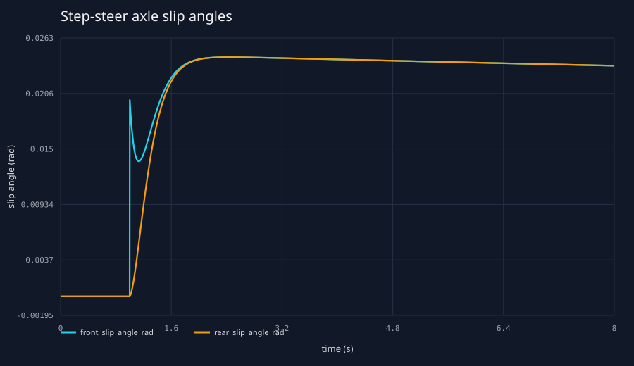
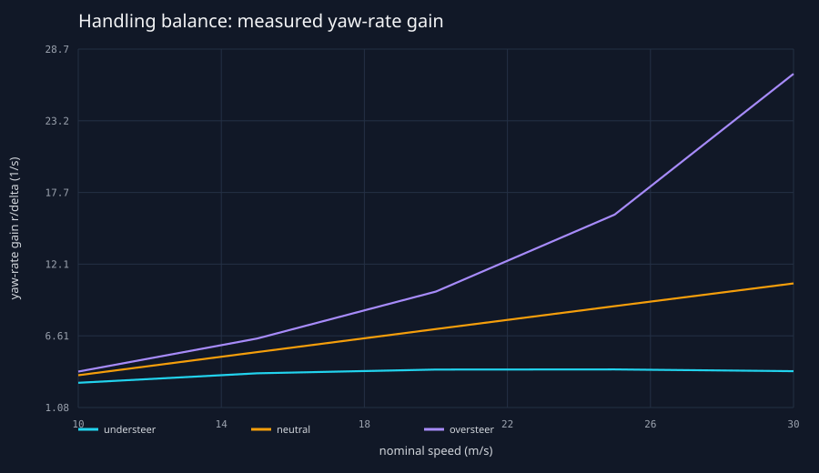
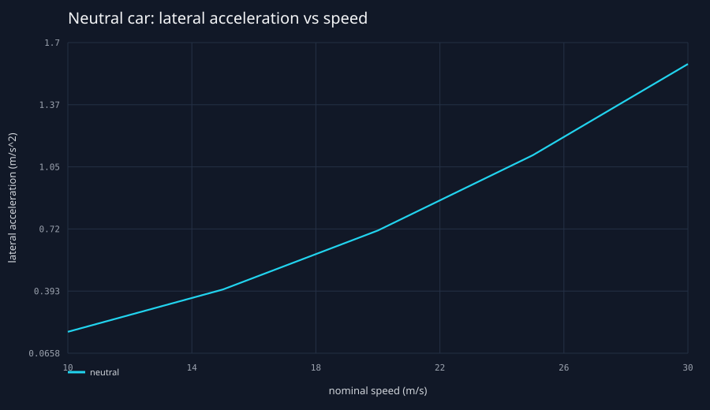
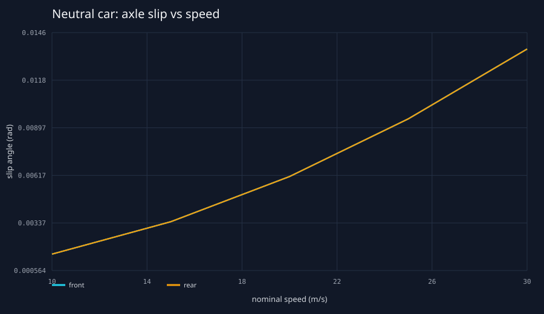
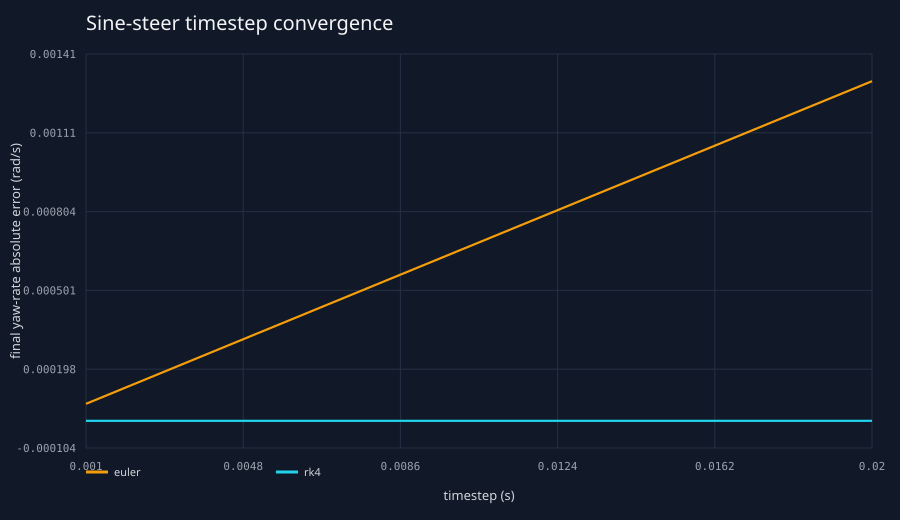

# Milestone 2 planar dynamics validation

This report is generated by `tools/python/validation/run_planar_validation.py` by launching the
compiled C++ CLI. The steady-state reference equations are implemented independently in Python;
they do not call the production planar force or derivative functions. Full-precision results and
all generated scenarios are in `data/generated/planar-validation`.

## Experiment 1 — Zero-steer invariance

**Question.** Does a symmetric state remain straight with zero steering and zero lateral initial
conditions?

**Hypothesis.** With `vy = r = delta = 0`, lateral tire forces and yaw moment remain exactly zero.

**Configuration and method.** Neutral fixture, `vx = 20 m/s`, RK4, `dt = 0.005 s`, 10 s. The
maximum absolute lateral/yaw states across every telemetry sample were measured.

| metric | maximum absolute value |
|---|---:|
| world y (m) | 0 |
| lateral velocity (m/s) | 0 |
| yaw (rad) | 0 |
| yaw rate (rad/s) | 0 |

**Result and interpretation.** All four values remained exactly zero in the recorded doubles. This
confirms symmetry and sign consistency for this condition; it is not a general stability result.

**Limitations.** This case has no perturbation, steering, drag, or rolling resistance.

## Experiment 2 — Constant-radius steady-state cornering

**Question.** Does settled constant steer agree with the independently derived linear bicycle
steady state?

**Hypothesis.** At a small `delta = 0.01 rad`, measured yaw rate, lateral velocity, acceleration,
and axle slip should be within 1% of the small-angle reference when evaluated at measured `vx`.

**Configuration and method.** Neutral fixture, initial `vx = 20 m/s`, a constant 0.0042 throttle
feed-forward to balance the small cornering loss, RK4, `dt = 0.002 s`, 12 s. Maximum speed
deviation was `0.00504472 m/s`. Values are means over the final
second. The reference uses
`r = V delta / (L + K V^2)` and axle moment/force balance, independent of production code.

| quantity | measured | reference | relative error |
|---|---:|---:|---:|
| yaw rate (rad/s) | 0.0714208218 | 0.0714204871 | 0.000% |
| lateral velocity (m/s) | -0.130559117 | -0.130542037 | 0.013% |
| lateral acceleration (m/s^2) | 1.42827608 | 1.42824808 | 0.002% |
| front slip (rad) | 0.0122429566 | 0.0122421264 | 0.007% |
| rear slip (rad) | 0.0122423956 | 0.0122421264 | 0.002% |
| turn radius (m) | 279.998688 | 280 | 0.000% |

**Result and interpretation.** Maximum relative error was `0.013%`. The residual is
expected because production uses exact `atan2` slip and front-force rotation while the closed form
uses small-angle assumptions; mean final-window `vx` was `19.9977 m/s`.

**Limitations.** This is model-to-model verification, not measured-vehicle validation.

## Experiment 3 — Step steer

**Question.** What transient yaw and lateral response follows a deterministic steering step?

**Hypothesis.** The stable neutral fixture should settle with bounded overshoot after a finite rise.

**Configuration and method.** `vx = 20 m/s`, steering steps from 0 to `0.02 rad` at 1 s,
RK4, `dt = 0.002 s`, total 8 s. Steady values are final-second means; 90% response time is
measured from the step to the first crossing.

| metric | value |
|---|---:|
| steady yaw rate (rad/s) | 0.139955395 |
| peak yaw rate (rad/s) | 0.142456173 |
| 90% response time (s) | 0.318 |
| overshoot | 1.78684% |
| steady lateral acceleration (m/s^2) | 2.74481794 |
| steady lateral velocity (m/s) | -0.237034286 |

**Result and interpretation.** The response is bounded and settles. Overshoot and response time
quantify the transient rather than relying on plot appearance.

**Limitations.** The model omits tire relaxation length, steering-system dynamics, and saturation.

## Experiment 4 — Understeer, neutral, and oversteer study

**Question.** Do deliberately selected axle stiffnesses produce mathematically and numerically
distinct handling balance?

**Hypothesis.** For `K = m/L (b/Cf - a/Cr)`, positive K reduces yaw-rate gain with speed, zero K
gives approximately `V/L`, and negative K increases gain toward its critical speed.

| fixture | Cf (N/rad) | Cr (N/rad) | K (s^2/m) | classification |
|---|---:|---:|---:|---|
| understeer | 70000 | 95000 | 0.00547798067 | K > 0 |
| neutral | 100000 | 75000 | 0 | K = 0 |
| oversteer | 120000 | 70000 | -0.00204081633 | K < 0 |

**Configuration and method.** Each fixture ran at 10, 15, 20, 25, and 30 m/s with
`delta = 0.005 rad`, RK4, `dt = 0.005 s`, and 10 s duration. Final-second yaw gain was compared
with the independent formula at measured mean `vx`. Maximum relative error across 15 runs was
`2.227%`.

**Result and interpretation.** The measured speed trends follow the signs of K; the labels are
therefore derived, not assigned by intuition. The oversteer fixture's linear critical speed is
`37.0405 m/s`, above
the tested range.

**Limitations.** Linear unsaturated tires can predict unbounded response near/above critical speed;
that region was deliberately excluded.

## Experiment 5 — Speed sensitivity

**Question.** How does the neutral fixture's response change with speed for equal steering?

**Hypothesis.** Neutral yaw-rate gain should grow approximately linearly with speed, while lateral
acceleration and slip grow more rapidly.

**Configuration and method.** The neutral subset of Experiment 4 was analyzed at the five speeds.
Yaw-rate gain increased from `3.57048` to
`10.647 1/s`; lateral acceleration increased from
`0.178477` to `1.58743 m/s^2`.

**Result and interpretation.** The response grows with speed as predicted by the steady-state
force balance. Front and rear slips coincide closely for this neutral stiffness ratio.

**Limitations.** Equal steering does not imply equal radius, and the highest-speed case remains a
linear-tire extrapolation rather than a physical grip-limit prediction.

## Experiment 6 — Timestep convergence

**Question.** Do smooth sine-steer outputs converge as timestep decreases, and how do Euler and RK4
compare?

**Hypothesis.** Both methods should converge, with RK4 substantially more accurate at equal step.

**Configuration and method.** A 20 m/s, 0.5 Hz, 0.02 rad-amplitude sine steer ran for 4 s at
20, 10, 5, 2, and 1 ms.
Errors are against a separate RK4 0.5 ms run; final yaw rate, lateral velocity, and yaw were
compared.

| integrator | dt (ms) | yaw-rate error (rad/s) | vy error (m/s) | yaw error (rad) |
|---|---:|---:|---:|---:|
| Euler | 1 | 6.53235106e-05 | 0.000409976905 | 9.82029125e-06 |
| RK4 | 1 | 3.46306317e-13 | 1.18594023e-12 | 5.56846236e-14 |

**Result and interpretation.** Errors decrease with timestep overall and RK4 is materially more
accurate. The smooth deterministic input avoids a control discontinuity dominating the integrator
comparison; the reported comparison measures actual end-state convergence.

**Limitations.** The 0.5 ms result is a numerical reference, not a closed-form transient solution.

## Overall limitations

These experiments validate the equations implemented, not a real car. The milestone omits
nonlinear tire saturation, combined slip, dynamic load transfer, per-wheel dynamics, suspension
kinematics, camber, toe, tire temperature/pressure, road banking/elevation, differential behavior,
aero-balance migration, and F1-specific dynamics. Forward motion above the documented low-speed
transition is the intended bicycle-model envelope.
