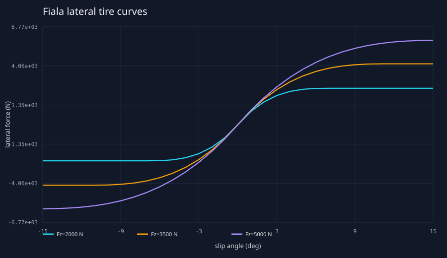
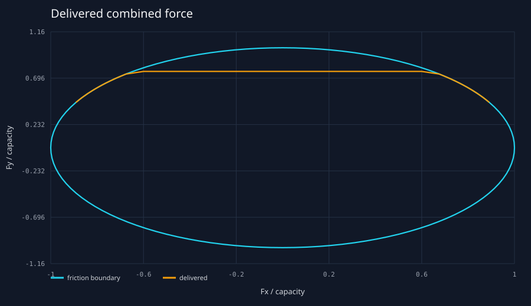
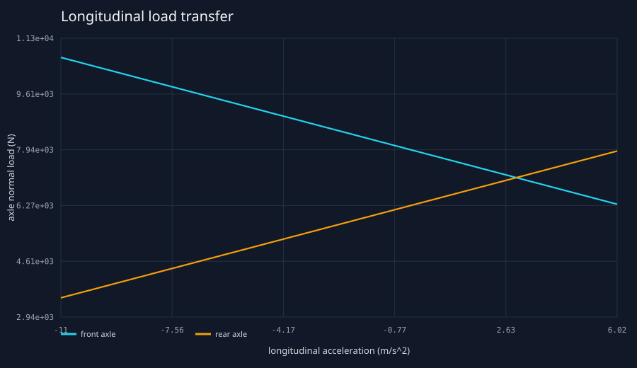
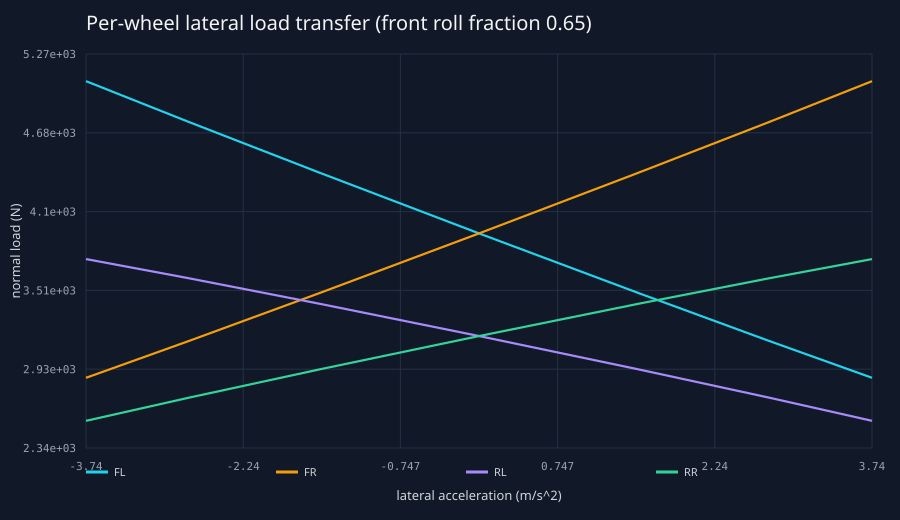
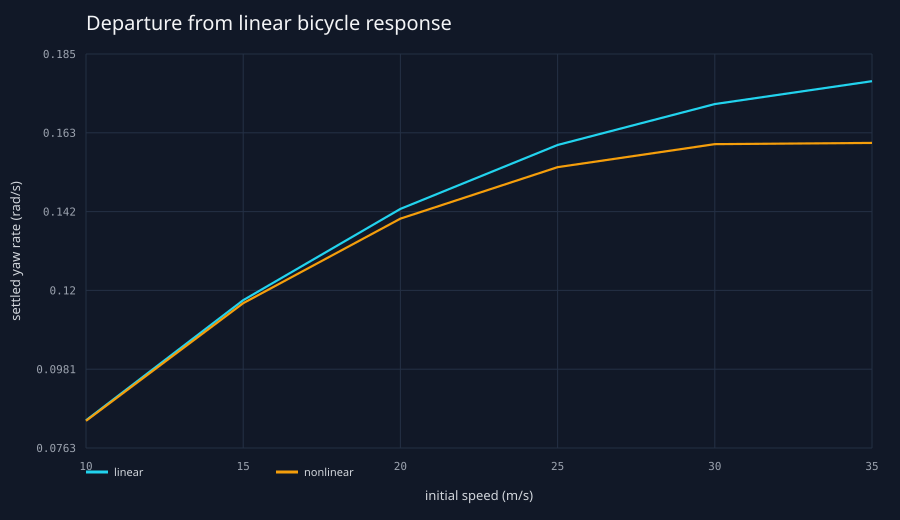
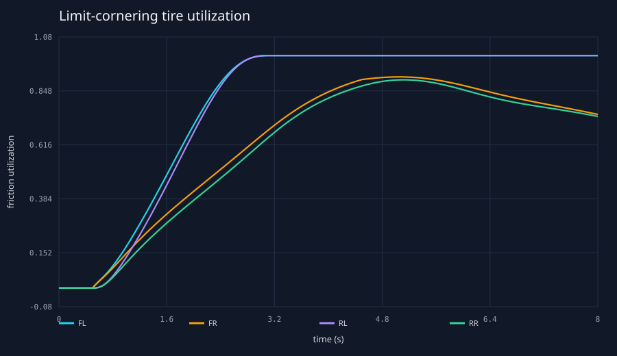
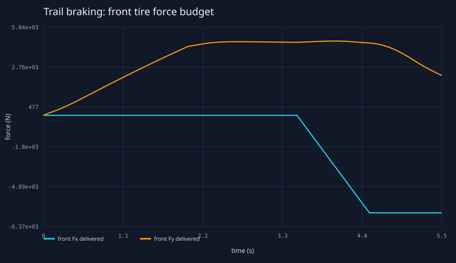
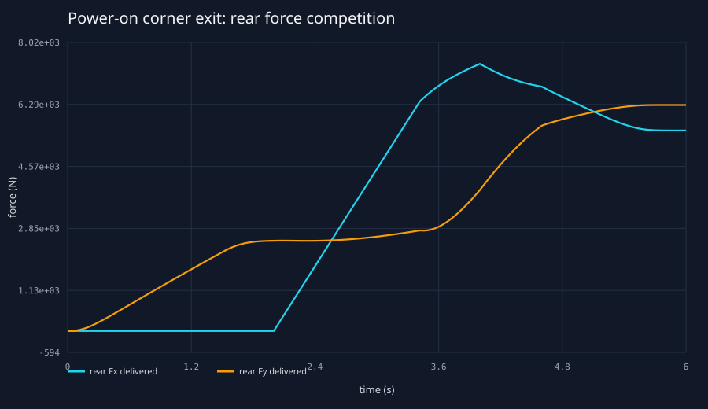
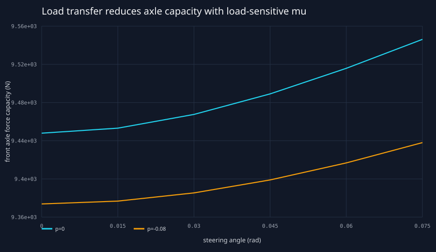
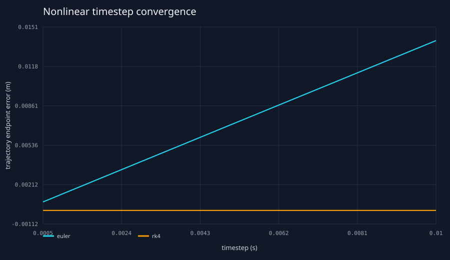

# Milestone 3 nonlinear grip-limit results

Generated by `tools/python/validation/run_milestone3_validation.py`. The C++ simulator is treated
as a black box; Fiala curves, friction-boundary checks, and load-transfer references are calculated
independently in Python. The vehicle is an illustrative reference, not OEM data.

## 1 — Nonlinear tire curve

**Question and hypothesis.** Does the tire retain the configured small-slip slope, transition
progressively, saturate finitely, and show decreasing effective mu with load? **Setup and method.**
Slip was swept from -15 to +15 degrees at 2000, 3500, and 5000 N. Zero-height probe vehicles made
wheel load exact. Production telemetry was compared pointwise with an independent Fiala function.
**Result.** Maximum difference was `2.72848411e-12 N`.
**Interpretation.** The curves show the linear region, brush transition, finite plateau, and load
sensitivity. **Limitation.** This is equation verification, not measured tire validation.

## 2 — Friction circle

**Question and hypothesis.** Does longitudinal demand consume lateral capacity? **Setup and
method.** At fixed load and slip, normalized requested Fx was swept from -1.5 to +1.5. **Result.**
Maximum delivered boundary excess was `0`.
**Interpretation.** Stronger braking or drive radially scales the force pair onto the finite circle.
**Limitation.** A circle is symmetric and omits measured combined-slip asymmetry.

## 3 — Longitudinal load transfer

**Question and hypothesis.** Do physical acceleration and braking shift load with the expected
sign while conserving weight? **Setup and method.** Hard acceleration, coast, moderate braking,
and hard braking were compared with `m ax h / L`. **Result.** Maximum reference error was
`0.000250378567 N`; maximum conservation error was
`1.8189894e-12 N`. **Interpretation.** Braking loads the front axle and
acceleration loads the rear. **Limitation.** Pitch is quasi-static and downforce is excluded.

## 4 — Lateral load transfer

**Question and hypothesis.** Are left/right loads mirrored and does roll distribution move the
transfer between axles? **Setup and method.** Mirrored steer sweeps used front roll fractions 0.40
and 0.65. **Result.** Outside-right tires gained load in every sampled left turn:
`True`; maximum conservation error was
`1.8189894e-12 N`. **Interpretation.** Front roll fraction directly changes
front versus rear utilization. **Limitation.** It stands in for suspension roll stiffness.

## 5 — Departure from linear bicycle theory

**Question and hypothesis.** When does the grip-limited model depart from the preserved linear
reference? **Setup and method.** Identical constant-steer runs swept initial speed; divergence was
defined before running as greater than 5% settled-yaw-rate difference. **Result.** The first sampled
speed above threshold was `30.0 m/s`. **Interpretation.** Fiala
nonlinearity, load sensitivity, and saturation limit the nonlinear response while the linear model
continues extrapolating. **Limitation.** Settled speed drifts slightly from the initial value.

## 6 — Limit cornering

**Question and hypothesis.** Which tires reach the limit first in a slow steering ramp? **Result.**
First saturation occurred at `3.111999999999879 s` on
`rl`; peak lateral acceleration was
`10.5744 m/s^2`. At first saturation the rear-left load/capacity
was `1336.562 N` /
`1734.437 N`. **Interpretation.** This
reference is rear-inside limited first: lateral transfer unloads the left tire and the lower rear
capacity is exhausted at the shared rear slip before the loaded outside tire.
**Limitation.** No relaxation length or roll transient is modeled.

## 7 — Trail braking

**Question and hypothesis.** Does braking consume front-tire budget during cornering? **Result.**
Front peak utilization changed from `0.6010` to
`0.7318`; front lateral force changed from
`4184.644` to `3439.772 N` while
front braking force was `-5580.000 N`. **Interpretation.** The force
front braking force was `-5580.000 N`; the remaining front lateral
circle capacity was `9493.552 N`. **Interpretation.**
The force budget is shared rather than independently clamped. **Limitation.** No ABS or wheel
rotation.

## 8 — Power-on corner exit

**Question and hypothesis.** Does rear-drive demand compete with rear lateral force? **Result.**
Rear peak utilization changed from `0.4149` to
`1.0000`. Requested/delivered rear drive was
`9000.000/6847.952 N`; rear lateral force
changed from `2498.855` to
`5477.806 N`, versus a pure-lateral request of
`6746.553 N`. **Interpretation.** The maneuver's lateral demand
grew with speed, but the saturated rear-left tire delivered less than its requested drive and
lateral force: drive demand consumed the rear force circle. **Limitation.** Static split replaces
a differential and wheelspin model.

## 9 — Load-sensitivity consequence

**Question and hypothesis.** Can redistribution reduce axle grip while total weight is unchanged?
**Result.** At maximum sampled steer the load-sensitive front capacity was
`1.1704%` below the p=0 comparison; total
weight error was `1.8189894e-12 N`. **Interpretation.** Capacity grows
sublinearly with Fz, so the outside gain does not compensate the inside loss. **Limitation.** The
power-law exponent is illustrative.

## 10 — Numerical convergence

**Question and hypothesis.** Do smooth nonlinear maneuvers converge with timestep? **Setup and
method.** Euler and RK4 used 10, 5, 2, 1, and 0.5 ms against a separate 0.25 ms RK4 reference.
**Result.** Reference final yaw rate was `-0.0721843404 rad/s`,
peak lateral acceleration `4.95629035 m/s^2`, and peak
utilization `0.723166594`. Errors are in `numerical_convergence.csv`.
**Interpretation.** Both methods converge; RK4 reaches a given error at a materially larger step.
**Limitation.** The finest run is a numerical, not closed-form, reference.

