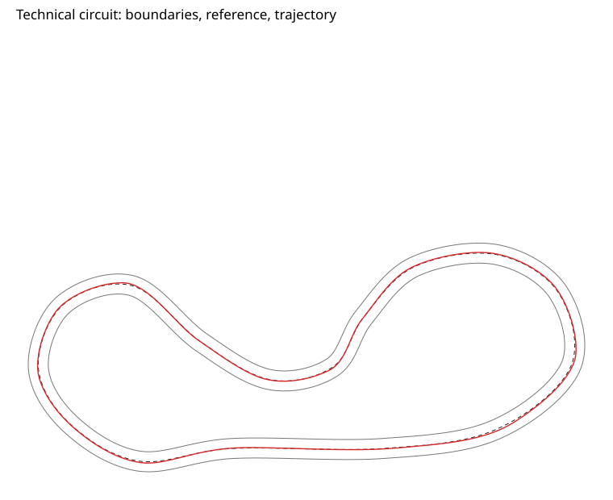
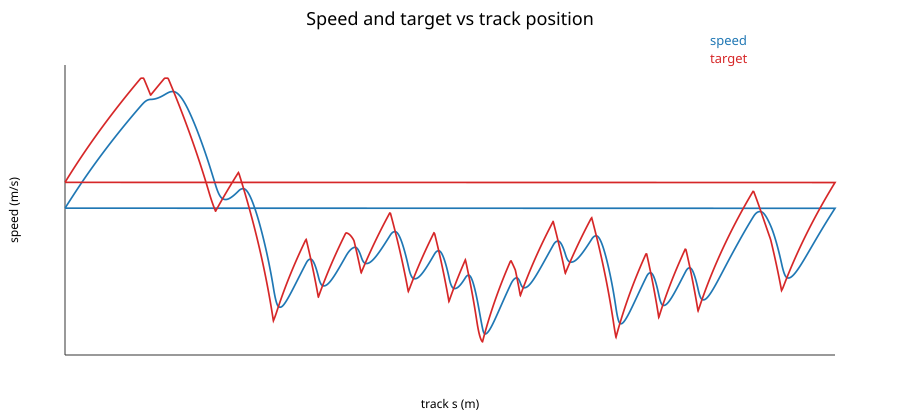
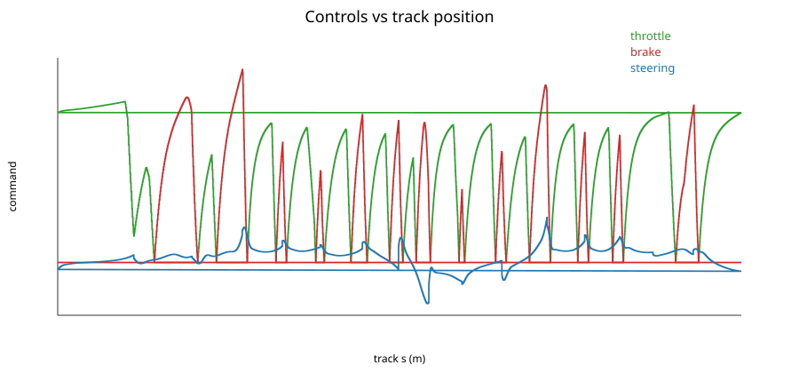
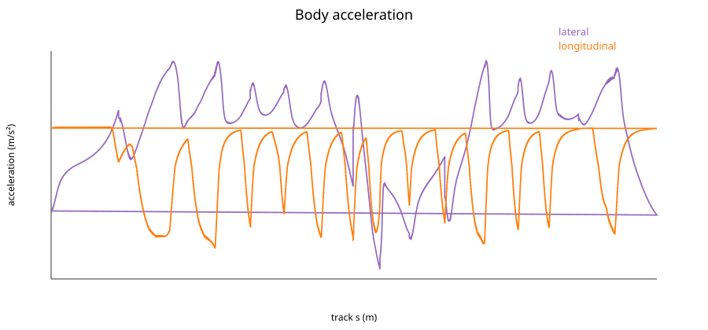
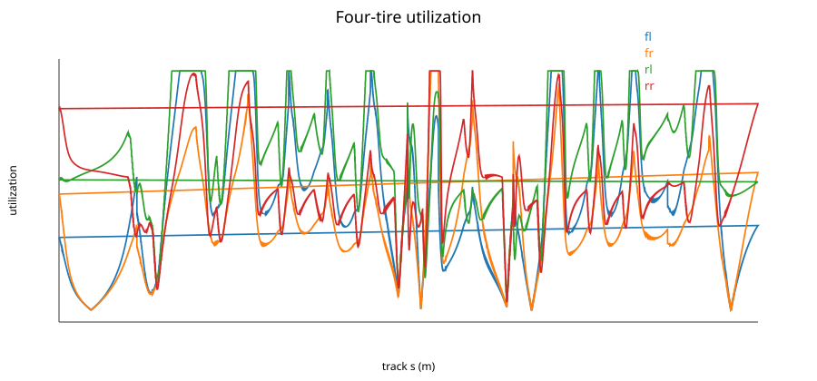
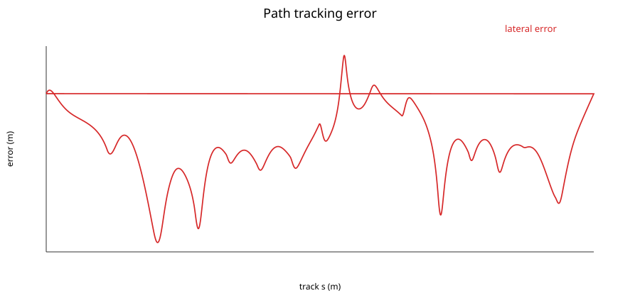
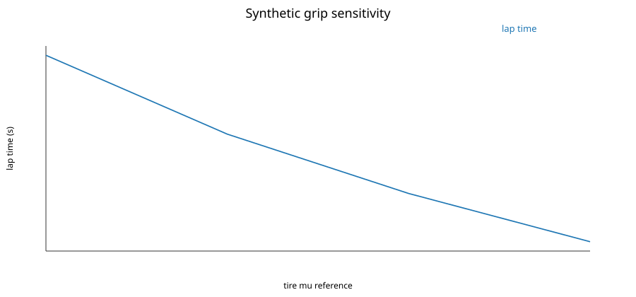
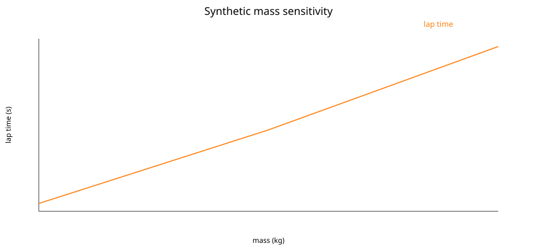

# Milestone 4 closed-track results

Generated by `tools/python/validation/run_milestone4_validation.py` from production C++ telemetry.

## Geometry and projection

The 60 m analytical circle length error was `0.000439423 m`, maximum radial error `0.000130514 m`, maximum curvature error `0.000120672 1/m`, and maximum coherent round-trip reconstruction error `1.00486e-14 m`. An independent Python cubic/derivative implementation agreed with C++ technical-track transition curvature within `1.73472e-17 1/m`.

## Feasible synthetic lap

The generated technical circuit is `1078.754 m`. After one settling lap, the simulated lap was `50.710 s` (mean `21.381 m/s`, range `12.865`–`38.201 m/s`). RMS/max lateral error were `0.520` / `1.488 m`; every timed sample remained on track. Peak lateral/acceleration/braking magnitudes were `9.188`, `3.173`, and `7.390 m/s²`. Peak tire utilization was `1.000000` on `rl` at `s=775.031 m`. The curvature/target-speed correlation was `-0.7697` (negative as intended).

## Sensitivities and convergence

Grip sweep lap times: mu=0.90: 56.280 s, mu=1.05: 53.230 s, mu=1.20: 50.935 s, mu=1.35: 49.070 s. The controlled higher-grip setup is the single-parameter setup comparison; differences concentrate at curvature-limited sections and their following acceleration zones.

Mass sweep lap times: 1200 kg: 50.670 s, 1450 kg: 50.935 s, 1700 kg: 51.235 s. Fixed force limits reduce acceleration and braking in acceleration units as mass rises; load sensitivity also changes effective tire friction.

RK4 timestep lap times with a fixed 20 ms controller update: dt=10 ms: 50.940 s, dt=5 ms: 50.935 s, dt=2.5 ms: 50.932 s.

These are feasible reference laps, not minimum-time or optimal laps. Results depend on the fixed reference line, conservative speed heuristic, controller, and current nonlinear vehicle model.
