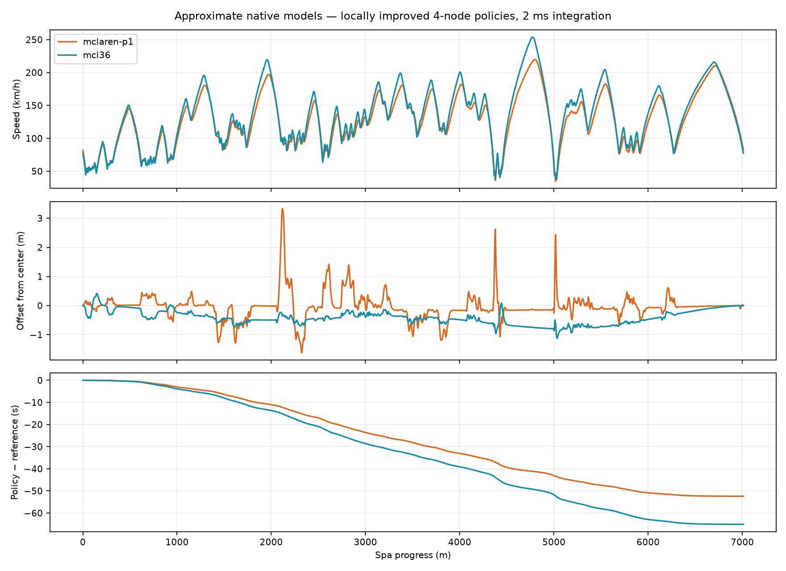
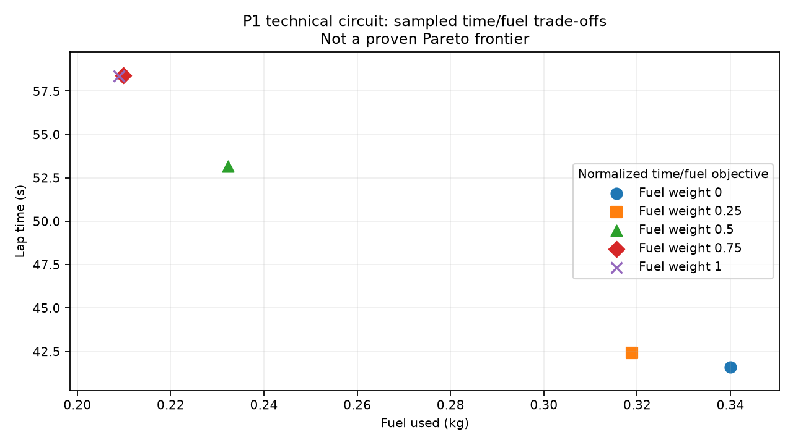
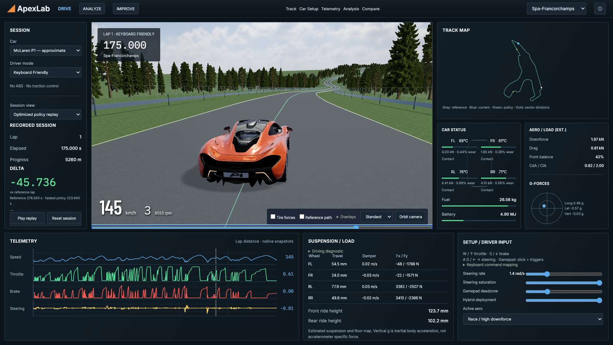

# Milestone 6 dynamics — implementation and final validation

Validated on 2026-09-20, Apple M2 Pro. This report follows the [expanded dynamics request](../architecture/milestone-6-dynamics-request.txt). The old planar simulator, reference controller and CasADi/IPOPT collocation optimizer remain available. Their results are not reused as new-model validation.

**Status:** the native contact model, vehicle/resource models, interactive driving, seven objective presets, force audit, Spa comparison UI and reproducible studies are implemented. The new optimizer is a restricted path-and-speed policy search. The requested unrestricted state/control optimal-control problem and robust open-loop Spa control replay are **not complete**. Four-node Spa results are useful validated feedback policies, not credible minimum-time limits of either real car.

## Open and reproduce

The pinned optimizer/report environment requires Python 3.12+ (tested 3.14). Native build: C++20/CMake 3.24+. Dashboard: Node 22.12+ and WebGL2.

```sh
cmake -S . -B build -DCMAKE_BUILD_TYPE=Release
cmake --build build -j 6
ctest --test-dir build --output-on-failure
python3 -m venv .cache/optimizer-venv
.cache/optimizer-venv/bin/pip install -r tools/dynamics/requirements.txt
python3 tools/dynamics/server.py
# In a second terminal:
npm --prefix apps/dashboard ci
npm --prefix apps/dashboard run dev
```

Open **http://127.0.0.1:5173/?drive**. Choose P1/MCL36 and Spa/Monza/Silverstone/Suzuka/Technical Test Circuit. `/` preserves the previous standalone replay application; `/?contact` opens contact fixtures. Source car packages and processed GLBs remain ignored: use [asset reproduction](../../assets/cars/README.md) on a fresh checkout. Local licensed assets are present in this workspace.

```sh
.cache/optimizer-venv/bin/python tools/dynamics/prepare_track.py
.cache/optimizer-venv/bin/python tools/dynamics/optimize.py --vehicle mclaren-p1 --track technical_test_circuit
.cache/optimizer-venv/bin/python tools/dynamics/optimize.py --vehicle mclaren-p1 --track spa-francorchamps
.cache/optimizer-venv/bin/python tools/dynamics/optimize.py --vehicle mcl36 --track spa-francorchamps
.cache/optimizer-venv/bin/python tools/dynamics/study.py
.cache/optimizer-venv/bin/python tools/dynamics/sensitivity.py
.cache/optimizer-venv/bin/python tools/dynamics/revalidate.py
.cache/optimizer-venv/bin/python tools/dynamics/revalidate.py data/generated/dynamics/study/*.json --output data/generated/dynamics/study/replay-audit.json
python3 tools/dynamics/validate_driving.py
.cache/optimizer-venv/bin/python tools/dynamics/report.py
```

Dense solver traces are ignored; compact summaries and reports are versionable. A clean checkout must run the commands to generate dynamic ghosts. The UI explicitly disables unavailable replay choices. Optimization is offline; IMPROVE starts the same script, reports progress and loads only an accepted result. No cloud service is required.

## 1–2. Contact and airborne model

The new C++ model integrates world position/velocity, quaternion attitude/angular rate and four body-axis unsprung sliders through a coupled 10×10 mass matrix. Independent road queries supply tire planes/materials. Unilateral compliant normal force drives the existing combined-force brush law: an airborne wheel has exactly zero Fx/Fy/Fz. There is no render grounding override. See [equations](../physics/contact-3d-model.md) and [30-run contact validation](milestone-6-dynamics-phase-a.md).

Synthetic no-aero crest: no full flight at 12/20 m/s entry; 0.640 s full-airborne time at 28 m/s and 2.018 s at 40 m/s, including rebound. At 40 m/s, 2/1/0.5 ms give 2.0180/2.0180/2.0175 s. Extreme landing compression is outside credible tire/suspension calibration; this is a numerical/contact stress test. Accepted Spa policies have zero full-airborne duration. This does not establish whether a real car becomes airborne at any real Spa crest.

## 3–5. Vehicle calibration, provenance and aero

P1 headline anchors come from [McLaren](https://cars.mclaren.com/us_en/legacy/mclaren-p1); F1 architecture from [MCL36 specifications](https://www.mclaren.com/racing/formula-1/2022/car-launch/mclaren-mcl36-technical-specification/) and the versioned FIA rules linked in [F1 provenance](../vehicles/mcl36-approx.md). Every dynamic parameter has a source class. Mass/power anchors do not make estimated tire, inertia, suspension or aero maps official.

| P1 metric | Published anchor | Fixed-mass mechanical bench | Difference |
|---|---:|---:|---:|
| 0–100 | 2.8 s | 2.7997 s | -0.0003 s |
| 0–200 | 6.8 s | 6.8001 s | +0.0001 s |
| 100–0 | 30 m | 30.0244 m | +0.0244 m |
| 200–0 | 116 m | 115.9273 m | -0.0727 m |
| Top speed | 350 km/h | 351.0030 km/h | +1.0030 km/h |

Calibration uses 13 least-squares iterations / 65 native calls, about 35.4 s. Resources are disabled for this controlled mechanical fit. The fitted road CdA reaches its bound: the headline fit is underidentified, not independent whole-vehicle validation. P1 uses a soft 350 km/h governor; MCL36 has none. See [calibration protocol](milestone-6-dynamics-phase-b-c.md).

P1 mass anchor 1490 kg includes the configured 30 kg reference fuel; MCL36 795 kg excludes fuel. Seven versus eight gear ratios and RPM/shift states affect wheel power. At 70 m/s in the fixed bench, P1 high-aero downforce is capped at 5.884 kN. MCL36 predicts 20.818 kN: estimated ride-height-sensitive floor plus wings. DRS changes drag 3.602→2.881 kN and downforce 20.818→18.837 kN, shifting front fraction 45→49.7%. These are model predictions, not measurements.

## 6–9. Fuel, hybrid, thermal and wear

Fuel flow follows delivered positive tire work and estimated engine efficiency, with F1 min(100, 0.009 RPM + 5.5) kg/h ceiling. Fuel changes sprung mass at its CG; tank CG/inertia migration is omitted. F1 MGU-K is bounded by 120 kW, 4 MJ deployment and 2 MJ recovery per lap. Rear braking recovery replaces existing braking work; it does not add free braking force. No MGU-H model. P1 capacity is an explicitly estimated 4.7 kWh; no P1 recovery is claimed.

Each tire integrates tread/carcass temperature and wear from slip/deformation work, air cooling and road conduction. Temperature/wear scale the existing force law. Thermal coefficients and wear law are generic estimates. No pressure, physical wheel-spin state, longitudinal-slip heat, ABS, TC or detailed differential. [Resource equations, conservation tests and approximations](../physics/resources.md).

## 10–13. Driving, input, ghosts and delta

A loopback Python HTTP host owns one native C++ simulator. Physics is fixed 500 Hz, snapshots 100 Hz, browser commands/polls 25 Hz; rendering does not advance physics. The input watchdog releases controls after 350 ms. W/S/A/D and arrows use rate-limited steering; Gamepad API uses analog steering/triggers with configurable deadzone/saturation/rate. Authentic has no hidden stabilizer; Assisted applies an explicitly named steering envelope.

Time Ghost samples accepted replay at player elapsed time. Distance Reference samples its monotonic s map. Live delta is t_player − t_policy(s); comparison delta is t_policy(s) − t_reference(s). Analysis sectors are equal thirds, not official timing loops. Map, trace and slider clicks seek one replay cursor. Reset reconstructs native physical/resource state. Vehicles can leave asphalt onto the native lower-grip grass surface without teleporting.

## 14–15. Solver and constraints

SciPy PRIMA COBYLA solves native single shooting with periodic Catmull–Rom lateral-offset and speed-scale nodes; no generic solver or alternate optimistic tire model was written. Full physical/resource states are integrated, but are not independent optimization variables. A completed native reference lap supplies the identical initial state for all candidates. Offsets are bounded ±3 m; speed scales 0.7–1.45 of reference. The start node is fixed. Minimum-time mode minimizes elapsed time. Other normalized terms cover path length, minimum clearance, front/rear utilization balance, body tilt/rates, fuel and wear; custom weights sum to one. Fuel/wear obey a 115% reference-time ceiling.

Clearance includes vehicle half-width + 0.25 m. It is not a yaw-dependent full-body envelope. Mechanical closure tolerances: 0.5 m/s body speed, 0.03 rad heading, 0.05 rad/s angular rate, 10 mm suspension. Fuel/temperature/wear need not be periodic. There are no collocation defects in this formulation; the recorded mass-equation residual measures a different quantity. [Full formulation](../physics/dynamic-optimization.md).

Acceptance requires bounded feasible trajectory, converged solver and independent half-step feedback replay within 0.5 m position, 0.5 m/s speed and 0.03 rad yaw. Recorded-control open-loop replay is also evaluated; it can diverge materially on Spa. Such policies are accepted only as feedback policies, **not validated open-loop optimal-control solutions**. Candidate selection rejects bound-violating COBYLA exploratory points. A faster P1 Spa candidate (223.660 s) failed the yaw gate; 223.940 s passed. The invalid F1 exploratory result 210.380 s was replaced by bounded 212.760 s. Audits are retained.

## 16–18. Vehicle-specific lines, force audit and lap results

| Track / model | Reference s | Accepted policy s | Improvement s | Solver evaluations | Solver wall s |
|---|---:|---:|---:|---:|---:|
| technical_test_circuit/mclaren-p1 | 50.800 | 41.480 | 9.320 | 28 | 65.54 |
| technical_test_circuit/mcl36 | 51.240 | 38.340 | 12.900 | 29 | 58.92 |
| spa-francorchamps/mclaren-p1 | 276.340 | 223.940 | 52.400 | 27 | 437.28 |
| spa-francorchamps/mcl36 | 277.880 | 212.760 | 65.120 | 35 | 552.83 |

Solver wall times include the initial final-candidate replay work, but later audit/selection reruns are additional. COBYLA reports evaluations rather than a separate iteration count. Four policy nodes give six variables and 16 reported inequalities including bounds. Peak solver memory was not measured.

| Model on Spa | Peak km/h | Peak braking g | Peak lateral g | Peak downforce kN | Fuel kg | Mean tire utilization ref → policy | Max offset change vs reference m | Largest 100 m gain |
|---|---:|---:|---:|---:|---:|---|---:|---|
| mclaren-p1 | 219.74 | 1.194 | 1.480 | 4.575 | 2.3432 | 0.312 → 0.446 | 3.071 | 4353.5–4453.5 m: 2.149 s |
| mcl36 | 253.78 | 1.435 | 1.491 | 18.076 | 1.1748 | 0.245 → 0.347 | 1.103 | 4354.4–4454.4 m: 2.956 s |

P1 versus F1 offset difference: RMS 0.611 m, maximum 3.673 m over common coverage. Lower F1 mass and larger speed-dependent aero/friction capacity change braking, speed and line response. Four coarse nodes do not resolve every apex; these laps remain far from real-car performance limits. Tire utilization peaks at 1 for both models; requested demand can exceed 1 while actual force remains saturated.



Force audit: steady ±0.035 rad steering at 15 m/s produces mirrored ±0.20930 rad/s yaw, radius 71.3937 m. Rear left/right lateral forces are 1323.59/1327.29 N inward in the left turn. World force reconstruction error is zero in the audit. UI arrows originate at actual contact patches and represent road-on-vehicle force. Tire Local/Body/World changes inspected components, not world arrow direction. [Machine audit](../../data/generated/dynamics/force-audit.json).

| Replay case | Max position m | Max speed m/s | Max yaw rad | Minimum clearance m | Closure normalized max |
|---|---:|---:|---:|---:|---:|
| technical_test_circuit / mclaren-p1 | 0.037015 | 0.021589 | 0.003798 | 4.3397 | 0.1512 |
| technical_test_circuit / mcl36 | 0.003954 | 0.010995 | 0.000263 | 6.3918 | 0.0302 |
| spa-francorchamps / mclaren-p1 | 0.025442 | 0.011414 | 0.005497 | 1.4403 | 0.1717 |
| spa-francorchamps / mcl36 | 0.027207 | 0.026629 | 0.000456 | 3.6225 | 0.0282 |

All four final replays complete: zero track/control violation, tire-force violation ≤4.45e−16 normalized, zero nonzero airborne tire forces. The largest native mass-equation residual is below 1e−11. Recorded lap endpoints are sampled at 20 ms; near-zero reported lap-time difference does not imply sub-millisecond accuracy. See [replay audit](../../data/generated/dynamics/final-replay-validation.json).

### Objective, grid and initialization study

| Case | Objective J | Time s | Clearance m | Closure ratio | Evaluations | Wall s | Accepted |
|---|---:|---:|---:|---:|---:|---:|---|
| mcl36-clearance | -1.035598 | 45.560 | 6.534 | 0.2088 | 30 | 71.60 | True |
| mcl36-fastest | 0.748244 | 38.340 | 6.392 | 0.0297 | 29 | 58.92 | True |
| mcl36-fuel | 0.849120 | 58.340 | 5.921 | 0.1652 | 29 | 84.24 | True |
| mcl36-neutral | 0.719018 | 58.820 | 6.224 | 0.0265 | 30 | 83.50 | True |
| mcl36-platform | 0.741601 | 58.840 | 6.105 | 0.0985 | 30 | 86.38 | True |
| mcl36-shortest | 0.984534 | 57.420 | 3.348 | 0.1513 | 73 | 191.72 | True |
| mcl36-wear | 0.883642 | 58.500 | 6.176 | 0.2821 | 25 | 70.10 | True |
| mclaren-p1-clearance | -1.037305 | 55.440 | 6.468 | 0.0900 | 27 | 74.39 | True |
| mclaren-p1-fastest | 0.818898 | 41.600 | 4.286 | 0.1406 | 25 | 55.94 | True |
| mclaren-p1-fuel | 0.849302 | 58.360 | 6.358 | 0.0593 | 28 | 77.75 | True |
| mclaren-p1-neutral | 0.760280 | 58.380 | 6.225 | 0.4083 | 30 | 83.25 | True |
| mclaren-p1-platform | 0.705541 | 58.300 | 6.395 | 0.0768 | 33 | 89.69 | True |
| mclaren-p1-shortest | 0.983763 | 58.020 | 3.484 | 0.1348 | 49 | 134.63 | True |
| mclaren-p1-wear | 0.789071 | 58.280 | 6.367 | 0.0476 | 32 | 88.70 | True |
| p1-grid-6 | 0.800787 | 40.680 | 4.640 | 0.4205 | 41 | 77.72 | True |
| p1-grid-8 | 0.793307 | 40.300 | 3.936 | 0.5083 | 69 | 124.46 | True |
| p1-initial--1 | 0.825197 | 41.920 | 3.298 | 0.2420 | 22 | 44.91 | True |
| p1-initial-1 | 0.811024 | 41.200 | 3.695 | 0.1298 | 28 | 53.89 | True |
| p1-pareto-fuel-0.25 | 0.950072 | 42.400 | 4.768 | 0.2627 | 27 | 55.69 | True |
| p1-pareto-fuel-0.5 | 0.995253 | 53.160 | 6.348 | 0.0353 | 16 | 45.18 | True |
| p1-pareto-fuel-0.75 | 0.927088 | 58.400 | 6.440 | 0.0460 | 29 | 78.90 | True |

All listed solver terminations reach their configured trust-region tolerance (study 0.04, primary 0.02). Objective values use different weights/scales and must not be ranked across presets. P1 4/6/8-node study lap times improve 41.60→40.68→40.30 s; this is **not sufficient to establish grid convergence**. Left/right initial guesses produce different local policies. All 21 final study replays pass: worst position error 0.4063 m, worst yaw error 0.01953 rad. [Per-case replay constraints](../../data/generated/dynamics/study/replay-audit.json); full constraints and normalized components are in [study summary](../../data/generated/dynamics/study/summary.json).

Grip/mass sensitivity: P1 μ×0.85 43.24 s; μ×1.15 coarse 40.02 s fails replay position (0.518 m), refined 1 ms solve 39.98 s passes at 0.5 ms. Mass×0.9 gives 41.36 s; mass×1.1 gives 42.04 s. Original configs are unchanged. [All attempts](../../data/generated/dynamics/sensitivity/summary.json).



## 19–20. UI, assets, geometry and environment

The new DRIVE workspace uses a restrained header, left session/delta column, dominant chase viewport, map/status/aero/G panels and bottom stacked telemetry, suspension/tire inspection and driver/solver controls. Gear, RPM, temperature, fuel and energy come from the new model; no pressure is shown. Tire inspection includes actual normalized force circle, temperature/wear/Fy history and force frames. Comparison shows both spatial traces and synchronized cursor.



Manual comparison with `docs/design/apexlab-target-ui.png`: major panel hierarchy, dark palette, density, orange P1, wooded elevated road and stacked traces now align much more closely. The road still lacks target-level surface art; billboard repetition and simple barriers are visible. The supplied GLB silhouette is retained. This is not a AAA or surveyed recreation. Further art/performance work remains.

P1 source 241,320 triangles / 16,772,489 bytes → 228,936 / 11,751,168 bytes; estimated decoded textures 69,847,873 bytes. F1 1,050,630 triangles / 67,774,007 bytes → same triangle count / 29,951,804 bytes; textures 39,146,834 bytes. Lossless Meshopt buffers, wheel pivots and separate visual/physics configs remain. CC-BY authors and source links are in [asset docs](../../assets/cars/README.md). No manual Sketchfab download is needed in this workspace; a clean checkout needs legally acquired source packages.

OSM import retains explicit course topology/selection, WGS84 local ENU metres and unscaled geometry; all four real circuits remain selectable. Spa uses Copernicus 30 m DSM, never laser-scan claims. Original import 7014.887 m vs 7004 m reference (+0.15544%). Native dynamic Spa has a separately named 35 m Gaussian height filter; XY unchanged, RMS height change 0.4981 m/max 3.5071 m, height range 102.123 m. The original comparison is retained as source_length_validation; the production C++ spline after dynamic filtering measures 7010.032747 m, +6.032747 m (+0.08613%) against 7004 m. Widths are estimated; banking zero.

Terrain remains bounded circuit-local. Physics kerb height is exported to the renderer; locations are illustrative, not mapped Spa kerbs. Barriers/fences/forest are visual only. Local Poly Haven CC0 HDR/surface maps total 3,821,179 bytes with manifest. Trees are instanced full-cluster alpha billboards in one draw call. The generated decorative atlas is `apps/dashboard/public/assets/environment/forest-atlas-generated.png`; its exact imagegen prompt and caveats are in [foliage provenance](../../assets/external/polyhaven-environment/generated-foliage.md). It is not an external photograph or scientific source.

## 21. Rendering performance

Headless Chromium, development Apple M2 Pro, 1672×944: mean frame 20.59 ms; p95 35.10 ms; 296 draw calls; 831,530 rendered triangles; 63 textures. Seek-to-two-frame measurements [175, 147, 139] ms. This is below the desired 60 fps. Figures include the measured final test view, not a controlled manual display benchmark.

P1 GLB response duration 788.4 ms; first rendered car 2367.6 ms after scene setup. The latter includes shared Suspense dependencies, decoding and first rendering, not isolated GLB decoding. Environment resource response timings: [{'file': 'sky.hdr', 'durationMs': 10.599999904632568, 'transferBytes': 1435419}, {'file': 'forest-atlas-generated.png', 'durationMs': 351.39999997615814, 'transferBytes': 2705846}]. Resource timings include local transfer/cache behavior; they are not disk cold-cache or isolated environment GPU-upload timings. Decoded texture estimates exclude shadow maps/framebuffers. Native Release real-time budget passes; UBSan timings are not compared with Release.

## 22. Verification and screenshots

- Release CTest: 17/17 passed, including preserved models, native input/shooting, contact, resources and force audit.
- UBSan: all 17 correctness tests passed across full run and focused rerun. The initial native-driver failure was a Release-only wall-clock assertion mistakenly applied to instrumentation; it is now limited to Release. The tests explicitly load the instrumented shared library.
- Frontend: 52 unit tests and production build passed. Full 23-test Playwright suite passed; final changed DRIVE interactions also rerun.
- Browser checks include keyboard/gamepad mock, vehicle switch/reset, replay seek, force-frame inspection, objective controls and no page errors. Hardware gamepad use has not been manually verified.
- Native driving smoke checks pass for both cars on all five circuits. A 20 s manual-input run reaches grass at 42.804 m offset without teleporting and resets to time zero. [Driving audit](../../data/generated/dynamics/driving-validation.json). Contact fixtures test grass, curb and crest departure/landing. The same native road/contact core runs interactively; destructive high-speed live-session handling is not an OEM-validated behavior.

Screenshots: `m6-target-comparison.png`, `m6-engineering-overlay.png`, `m6-reference-optimized.png`, `m6-telemetry-comparison.png`, `m6-track-map-comparison.png`, `m6-optimization-panel.png`, `m6-drive-p1.png`, `m6-drive-f1.png`, `m6-drive-forces.png`, `m6-contact-airborne.png`, `m6-contact-curb.png` under `docs/screenshots/`.

## 23. Remaining approximations and next work

The highest-priority next step is full-state multiple shooting/collocation with direct steering/power/ERS/DRS decisions, stricter periodicity, fine-grid convergence and robust independent control replay. The present feedback-policy results must keep their scoped label. Follow with better road elevation/width measurements, measured tire/aero identification, nonlinear impact/bottoming, yaw-dependent body envelope and render profiling/LOD. Extreme-impact credibility, detailed suspension geometry, wheel angular dynamics and thermal parameter identification remain open. Multiplayer and additional ABS/TC systems were not started.

This report therefore records implemented phases and measured limits, rather than declaring every requested optimal-control and visual-quality completion criterion fulfilled.
